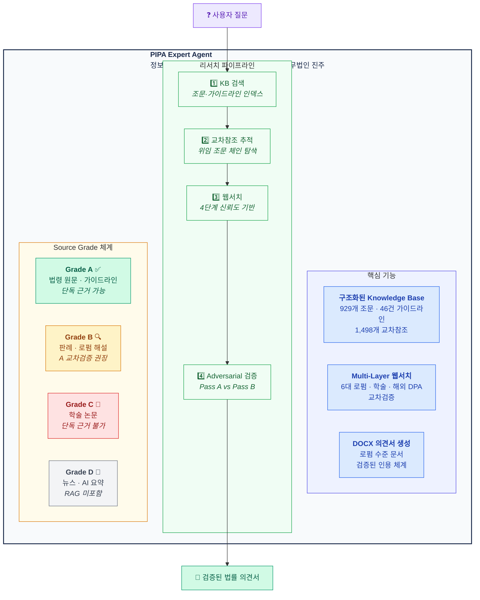

<div align="center">

# PIPA Expert Agent

### AI 개인정보보호법 전문 자문 시스템

**929개 법조문** · **46건 공식 가이드라인** · **1,498개 교차참조** · **로펌 수준 DOCX 의견서**

[Claude Code](https://claude.ai/claude-code) 전용 · 구조화된 RAG 기반

[](#-knowledge-base-법령-라이브러리)
[](#-knowledge-base-법령-라이브러리)
[](#-knowledge-base-법령-라이브러리)
[](#-knowledge-base-법령-라이브러리)

<br/>

> *"데이터 구조가 곧 지능이다."*
> — 더 똑똑한 검색이 아니라, 더 똑똑한 데이터를 추구합니다.

</div>

---

## 문제 인식

기존 AI 법률 어시스턴트(ChatGPT Custom GPT, Gemini Gem 등)는 법령을 단순 텍스트 문서로 취급합니다. PDF를 업로드하고, 의미 검색을 돌리고, 결과를 기대합니다. 이 방식은 법률 업무에 **근본적으로 부적합**합니다:

- **계층 구조 무시** — 법률은 조·항·호·목의 계층을 가짐
- **교차참조 단절** — 제15조가 시행령 제17조에 위임하는 관계를 모름
- **소스 권위 미구분** — PIPC 가이드라인과 뉴스 기사를 동일하게 취급
- **검증 불가** — 인용된 조문 번호가 실제로 존재하는지 확인할 수 없음

결과? 환각된 조문 번호, 조작된 규정, 어떤 변호사도 서명하지 않을 의견서.

---

## 해결 방안

PIPA Expert는 다른 접근을 취합니다: **더 똑똑한 검색 대신, 더 똑똑한 데이터를 구축합니다.**



---

## Knowledge Base (법령 라이브러리)

### 공식 법령 — Open Law API 수집

대한민국 [국가법령정보센터](https://law.go.kr) Open API에서 현행 법령을 수집하여, **조문 단위 Markdown 파일**로 파싱 및 구조화합니다. 각 파일에 YAML frontmatter(키워드, 교차참조, 시행일 등)가 포함됩니다. **월 1회 자동 업데이트.**

| 법령 | 조문 수 | 교차참조 | 디렉토리 |
|------|---------|---------|---------|
| **개인정보 보호법** | 126 | 190 | `library/grade-a/pipa/` |
| 개인정보 보호법 시행령 | 140 | 306 | `library/grade-a/pipa-enforcement-decree/` |
| 정보통신망법 | 142 | 119 | `library/grade-a/network-act/` |
| 정보통신망법 시행령 | 131 | 203 | `library/grade-a/network-act-enforcement-decree/` |
| 정보통신망법 시행규칙 | 11 | 16 | `library/grade-a/network-act-enforcement-rule/` |
| 신용정보법 | 91 | 138 | `library/grade-a/credit-info-act/` |
| 신용정보법 시행령 | 81 | 263 | `library/grade-a/credit-info-act-enforcement-decree/` |
| 위치정보법 | 53 | 73 | `library/grade-a/location-info-act/` |
| 위치정보법 시행령 | 55 | 121 | `library/grade-a/location-info-act-enforcement-decree/` |
| 전자정부법 | 99 | 69 | `library/grade-a/e-government-act/` |
| **합계** | **929** | **1,498** | |

### PIPC 공식 가이드라인 — 46건

개인정보보호위원회가 발행한 공식 가이드라인 전수를 PDF에서 구조화된 Markdown으로 변환하여 보유하고 있습니다.

<details>
<summary><b>46건 가이드라인 전체 목록</b></summary>

| # | 제목 |
|---|------|
| 01 | 개인정보 보호법령 해설서 |
| 02 | 개인정보 처리 통합 안내서 |
| 03 | 공공/민간 분야별 안내서 |
| 04 | 재난/감염병 긴급 처리 |
| 05 | 아동·청소년 개인정보 보호 |
| 06 | 인터넷 게시물 접근배제 요청권 |
| 07 | 자동화된 의사결정 |
| 08 | 안전성 확보조치 기준 |
| 09 | 개발자를 위한 개인정보 보호 |
| 10 | 생체정보 보호 |
| 11 | 고정형 영상정보처리기기 |
| 12 | 이동형 영상정보처리기기 |
| 13 | 스마트시티 |
| 14 | 홈페이지 개인정보 노출방지 |
| 15 | 합성데이터 활용 |
| 16 | 가명정보 처리 가이드라인 |
| 17 | 가명정보 (공공분야) |
| 18 | 가명정보 (교육분야) |
| 19 | 보건의료 데이터 |
| 20 | 합성데이터 레퍼런스 모델 |
| 21 | 공공데이터 AI 개발 |
| 22 | AI 프라이버시 리스크 평가 |
| 23 | 생성형 AI 개인정보 처리 |
| 24 | 개인정보 처리방침 작성 |
| 25 | 개인정보 영향평가 |
| 26 | 영향평가 비용 산정 |
| 27 | ISMS-P 인증 |
| 28 | 개인정보 보호 교육 |
| 29 | 유출 대응 매뉴얼 |
| 30 | 외국 사업자 PIPA 적용 (한/영) |
| 31 | 손해배상 책임보험 |
| 32 | Q&A 모음 |
| 33 | 데이터 이동권 |
| 34-36 | 관리전문기관 지정 |
| 37 | 일반 데이터 수령자 등록 |
| 38 | 마이데이터 전송 절차 |
| 39a-c | 업종별 안내서 (부동산/숙박/학원) |
| 40 | 소상공인 핸드북 |
| 41a-c | 표준 개인정보 처리방침 템플릿 |

</details>

### 데이터 구조화 방식

모든 법조문은 개별 `.md` 파일로 저장되며, 풍부한 메타데이터가 포함됩니다:

```yaml
---
law: "개인정보 보호법"
article: 15
article_title: "개인정보의 수집ㆍ이용"
source_grade: "A"
effective_date: "20251002"
cross_references:
  - "제17조"
  - "제22조"
keywords:
  - "수집"
  - "동의"
  - "정당한 이익"
---

## 제15조(개인정보의 수집ㆍ이용)

① 개인정보처리자는 다음 각 호의 어느 하나에 해당하는 경우에는...
```

이를 통해 AI 에이전트는:
- 인덱스 파일로 **키워드 검색** 가능
- 교차참조를 따라 **관련 조문 추적** 가능
- Grade 체계로 **소스 권위 검증** 가능
- 정확한 조문 원문을 **환각 없이 읽기** 가능

---

## 동작 방식

```
사용자 질문
     │
     ▼
┌─────────────────────────────┐
│  Step 1: KB 검색             │  article-index.json → 관련 조문
│  Step 2: 가이드라인 검색      │  guideline-index.json → PIPC 해설
│  Step 3: 교차참조 추적        │  cross-reference-graph → 관련 규정
│  Step 4: 웹서치              │  4단계 신뢰도 기반 외부 검색
│          (KB 부족 시)        │
├─────────────────────────────┤
│  Layer 1: 법령 원문          │  law.go.kr, pipc.go.kr
│  Layer 2: 6대 로펌           │  김장, 태평양, 광장, 세종, 율촌, 화우
│  Layer 3: 학술               │  KCI, RISS, SSRN
│  Layer 4: 해외 감독기관       │  EDPB, ICO, IAPP
├─────────────────────────────┤
│  Adversarial 교차검증        │  Pass A (긍정 근거) vs
│  (해석 질문 시)              │  Pass B (반례 탐색)
├─────────────────────────────┤
│  출력                        │  검증된 인용 + DOCX 의견서
└─────────────────────────────┘
```

모든 인용에 검증 상태가 표시됩니다:

| 태그 | 의미 |
|------|------|
| `[VERIFIED]` | Grade A 소스에서 정확히 매칭 |
| `[UNVERIFIED]` | Grade B만 존재하거나 부분 일치 |
| `[INSUFFICIENT]` | 근거 부족 — 해당 부분 빈칸 |
| `[CONTRADICTED]` | 소스 간 모순 — 양쪽 모두 제시 |

---

## DOCX 법률의견서 생성

에이전트는 **로펌 수준의 Word 문서**를 생성합니다:

- 법무법인 진주 레터헤드
- 구조화된 섹션: 쟁점 → 분석 → 결론 → 권고
- 색상 코딩된 리스크 매트릭스 테이블
- 검증 상태 표시된 전체 인용 체계
- 서명란 및 면책 조항
- AI 생성 고지

---

## 소스 Ingest 시스템

PDF, DOCX 등 아무 파일이나 `library/inbox/`에 넣고 `/ingest` 실행:

```
library/inbox/    ← 파일 드롭
     │
     ▼ /ingest
     │
     ├─ Markdown 자동 변환 (MarkItDown)
     ├─ Grade 자동 판별 (A/B/C — 내용 분석 기반)
     ├─ Frontmatter 자동 생성 (키워드, 인용, 메타데이터)
     ├─ library/grade-{a,b,c}/ 에 배치
     └─ 검색 인덱스 업데이트
```

---

## 시작하기

### 사전 요구사항

- [Claude Code](https://claude.ai/claude-code) CLI
- Python 3.10+
- `python-docx` (`pip install python-docx`)

### 설치

```bash
git clone https://github.com/lowtidebuild/PIPA-expert.git
cd PIPA-expert
pip install python-docx
```

### 법령 데이터 갱신 (월 1회)

```bash
python3 scripts/fetch-pipa-from-api.py --oc YOUR_EMAIL_ID
```

[Open Law API](https://open.law.go.kr) 무료 계정 필요. `--oc` 파라미터는 등록된 이메일 ID입니다.

### 에이전트 실행

```bash
cd PIPA-expert
claude   # Claude Code 실행
```

이후 `/agents/pipa-agent`로 PIPA 전문 에이전트 활성화.

### 예시 질문

```
"개인정보보호법 제15조 보여줘"
"맞춤형 광고 동의 구조 재설계 방안 의견서 작성해줘"
"정보통신망법과 개인정보보호법의 동의 규정 차이점"
"제3자 제공 관련 법률의견서 DOCX로 만들어줘"
```

---

## 법무법인 진주 (Law Firm Pearl)

PIPA Expert는 가상의 **법무법인 진주** 소속 전문 법률 AI 에이전트 시리즈 중 하나입니다:

| 에이전트 | 변호사 | 연차 | 전문 분야 |
|---------|--------|------|----------|
| [game-legal-research](https://github.com/lowtidebuild/game-legal-research) | 심진주 | 3년차 | 게임 산업법 |
| [legal-translation-agent](https://github.com/lowtidebuild/legal-translation-agent) | 변혁기 | 4년차 | 법률 번역 |
| **PIPA-expert** | **정보호 (鄭保護)** | **5년차** | **개인정보보호법** |
| [second-review-agent](https://github.com/lowtidebuild/second-review-agent) | 반성문 | 10년차 | 품질 리뷰 (파트너) |

---

## 라이선스

MIT

---

<div align="center">
<sub>임베딩에 대한 맹신이 아니라, 구조화된 데이터 위에 세워졌습니다.</sub>
</div>
