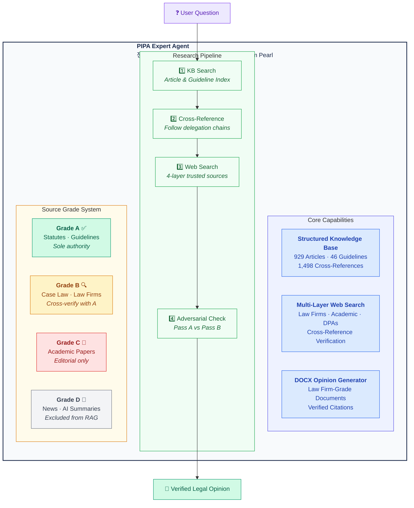

<div align="center">

# PIPA Expert Agent

### AI-Powered Korean Data Privacy Law Advisor

**929 statute articles** · **46 official guidelines** · **1,498 cross-references** · **Law firm-grade DOCX opinions**

Built for [Claude Code](https://claude.ai/claude-code) · Powered by structured RAG

[](#-knowledge-base)
[](#-knowledge-base)
[](#-knowledge-base)
[](#-knowledge-base)
[](#license)

<br/>

> *"Data structure is intelligence."*
> — The philosophy behind this project: smarter data beats smarter search.

</div>

---

## The Problem

Existing AI legal assistants (ChatGPT Custom GPTs, Gemini Gems, etc.) treat legislation as flat text documents. They upload PDFs, run semantic search, and hope for the best. This approach **fundamentally fails** for legal work because it ignores:

- **Hierarchical structure** — statutes have articles, paragraphs, subparagraphs, and items
- **Cross-references** — Article 15 delegates to Enforcement Decree Article 17
- **Source authority** — a PIPC guideline ≠ a news article ≠ an academic paper
- **Verification** — every citation must be traceable to the exact provision

The result? Hallucinated article numbers, fabricated provisions, and opinions that no lawyer would sign.

---

## The Solution

PIPA Expert takes a different approach: **instead of smarter search, build smarter data.**



---

## Knowledge Base

### Official Legislation — via Open Law API

Every statute is fetched from Korea's [National Law Information Center](https://law.go.kr) Open API, parsed into **individual article-level Markdown files** with YAML frontmatter, and enriched with keyword extraction and cross-reference mapping. Updated monthly.

| Law | Articles | Cross-Refs | Directory |
|-----|----------|------------|-----------|
| **Personal Information Protection Act (PIPA)** | 126 | 190 | `library/grade-a/pipa/` |
| PIPA Enforcement Decree | 140 | 306 | `library/grade-a/pipa-enforcement-decree/` |
| Network Act (정보통신망법) | 142 | 119 | `library/grade-a/network-act/` |
| Network Act Enforcement Decree | 131 | 203 | `library/grade-a/network-act-enforcement-decree/` |
| Network Act Enforcement Rule | 11 | 16 | `library/grade-a/network-act-enforcement-rule/` |
| Credit Information Act (신용정보법) | 91 | 138 | `library/grade-a/credit-info-act/` |
| Credit Information Act Enforcement Decree | 81 | 263 | `library/grade-a/credit-info-act-enforcement-decree/` |
| Location Information Act (위치정보법) | 53 | 73 | `library/grade-a/location-info-act/` |
| Location Information Act Enforcement Decree | 55 | 121 | `library/grade-a/location-info-act-enforcement-decree/` |
| E-Government Act (전자정부법) | 99 | 69 | `library/grade-a/e-government-act/` |
| **Total** | **929** | **1,498** | |

### PIPC Official Guidelines — 46 Documents

All publicly available guidelines from the Personal Information Protection Commission (PIPC), converted from PDF to structured Markdown with frontmatter metadata.

<details>
<summary><b>Full list of 46 guidelines</b></summary>

| # | Title |
|---|-------|
| 01 | Commentary on PIPA (법령해설서) |
| 02 | Integrated Processing Guide (처리 통합 안내서) |
| 03 | Sector-Specific Guide (공공/민간) |
| 04 | Emergency Processing (재난/감염병) |
| 05 | Children & Adolescents Protection |
| 06 | Internet Content Access Exclusion Right |
| 07 | Automated Decision-Making |
| 08 | Safety Standards |
| 09 | Developer Privacy |
| 10 | Biometric Information |
| 11 | Fixed Video Surveillance |
| 12 | Mobile Surveillance |
| 13 | Smart City |
| 14 | Website Exposure Prevention |
| 15 | Synthetic Data Utilization |
| 16 | Pseudonymization Guidelines |
| 17 | Pseudonymization (Public Sector) |
| 18 | Pseudonymization (Education) |
| 19 | Healthcare/Medical Data |
| 20 | Synthetic Data Reference Model |
| 21 | AI Development (Public Data) |
| 22 | AI Privacy Risk Assessment |
| 23 | Generative AI Processing |
| 24 | Privacy Policy Drafting |
| 25 | Privacy Impact Assessment |
| 26 | PIA Cost Estimation |
| 27 | ISMS-P Certification |
| 28 | Privacy Education |
| 29 | Breach Response Manual |
| 30 | Foreign Business PIPA Application (KR + EN) |
| 31 | Liability Insurance |
| 32 | Q&A Compilation |
| 33 | Data Portability |
| 34-36 | Management Agency Designation |
| 37 | General Data Recipient Registration |
| 38 | MyData Transfer Procedures |
| 39a-c | Industry-Specific Guides |
| 40 | Small Business Handbook |
| 41a-c | Standard Privacy Policy Templates |

</details>

### How the Data is Structured

Every article is stored as a standalone `.md` file with rich frontmatter:

```yaml
---
law: "개인정보 보호법"
article: 15
article_title: "개인정보의 수집ㆍ이용"
source_grade: "A"
effective_date: "20251002"
cross_references:
  - "제17조"
  - "제22조"
keywords:
  - "수집"
  - "동의"
  - "정당한 이익"
---

## 제15조(개인정보의 수집ㆍ이용)

① 개인정보처리자는 다음 각 호의 어느 하나에 해당하는 경우에는...
```

This means the AI agent can:
- **Search by keyword** using the index files
- **Follow cross-references** to related articles
- **Verify source authority** via the grade system
- **Read exact provisions** without hallucination

---

## How It Works

```
User Question
     │
     ▼
┌─────────────────────────────┐
│  Step 1: KB Search          │  article-index.json → relevant articles
│  Step 2: Guideline Search   │  guideline-index.json → PIPC guidance
│  Step 3: Cross-Reference    │  cross-reference-graph → related provisions
│  Step 4: Web Search         │  4 layers of trusted external sources
│          (if KB insufficient)│
├─────────────────────────────┤
│  Layer 1: Statutes          │  law.go.kr, pipc.go.kr
│  Layer 2: Law Firms         │  Kim & Chang, BKL, Lee & Ko,
│                             │  Shin & Kim, Yulchon, Yoon & Yang
│  Layer 3: Academic          │  KCI, RISS, SSRN
│  Layer 4: Foreign DPAs      │  EDPB, ICO, IAPP
├─────────────────────────────┤
│  Adversarial Cross-Check    │  Pass A (supporting) vs
│  (for interpretation Qs)    │  Pass B (counterarguments)
├─────────────────────────────┤
│  Output                     │  Verified citations + DOCX opinion
└─────────────────────────────┘
```

Every citation is tagged with its verification status:

| Tag | Meaning |
|-----|---------|
| `[VERIFIED]` | Exact match in Grade A source |
| `[UNVERIFIED]` | Grade B only, or partial match |
| `[INSUFFICIENT]` | Not enough evidence — left blank |
| `[CONTRADICTED]` | Sources conflict — both sides shown |

---

## DOCX Legal Opinion Generator

The agent produces **law firm-grade Word documents** with:

- Professional letterhead (법무법인 진주 / Law Firm Pearl)
- Structured sections: Issues → Analysis → Conclusions → Recommendations
- Risk matrix tables with color coding
- Full citation trail with verification status
- Signature block and disclaimer
- AI disclosure notice

---

## Source Ingest System

Drop any PDF, DOCX, or other document into `library/inbox/` and run `/ingest`:

```
library/inbox/    ← drop files here
     │
     ▼ /ingest
     │
     ├─ Auto-convert to Markdown (via MarkItDown)
     ├─ Auto-classify Grade (A/B/C based on content signals)
     ├─ Auto-generate frontmatter (keywords, citations, metadata)
     ├─ Place in library/grade-{a,b,c}/
     └─ Update search indexes
```

---

## Project Structure

```
PIPA-expert/
├── library/
│   ├── inbox/                    # Drop zone for new sources
│   ├── grade-a/                  # Authoritative sources
│   │   ├── pipa/                 #   PIPA articles (126)
│   │   ├── pipa-enforcement-decree/  #   Enforcement Decree (140)
│   │   ├── network-act/          #   Network Act (142)
│   │   ├── pipc-guidelines/      #   Official guidelines (46)
│   │   └── ...                   #   + 6 more statute sets
│   ├── grade-b/                  # Case law, law firm analysis
│   └── grade-c/                  # Academic papers
├── index/
│   ├── article-index.json        # Searchable article index (929 entries)
│   ├── guideline-index.json      # Guideline index (46 entries)
│   └── source-registry.json      # Collection status dashboard
├── config/
│   ├── source-grades.json        # A/B/C/D grade definitions
│   └── rag-config.json           # Search configuration
├── scripts/
│   ├── fetch-pipa-from-api.py    # Open Law API collector
│   ├── preprocess-guidelines.py  # PDF → Markdown pipeline
│   └── build-guideline-index.py  # Index generator
├── .claude/
│   ├── agents/pipa-agent.md      # Agent definition
│   └── skills/
│       ├── legal-opinion-formatter/  # DOCX generation skill
│       └── ingest/               # Source ingestion skill
├── output/opinions/              # Generated DOCX opinions
└── docs/                         # Design specs
```

---

## Getting Started

### Prerequisites

- [Claude Code](https://claude.ai/claude-code) CLI
- Python 3.10+
- `python-docx` (`pip install python-docx`)

### Setup

```bash
git clone https://github.com/lowtidebuild/PIPA-expert.git
cd PIPA-expert
pip install python-docx
```

### Refresh Law Data (Monthly)

```bash
python3 scripts/fetch-pipa-from-api.py --oc YOUR_EMAIL_ID
```

Requires a free [Open Law API](https://open.law.go.kr) account. The `--oc` parameter is your registered email ID.

### Run the Agent

```bash
cd PIPA-expert
claude   # launches Claude Code in this directory
```

Then use `/agents/pipa-agent` to activate the PIPA expert persona.

### Example Queries

```
"개인정보보호법 제15조 보여줘"
"맞춤형 광고 동의 구조 재설계 방안 의견서 작성해줘"
"정보통신망법과 개인정보보호법의 동의 규정 차이점"
"제3자 제공 관련 법률의견서 DOCX로 만들어줘"
```

---

## Part of Law Firm Pearl

PIPA Expert is one of several specialized legal AI agents operating under the fictional **법무법인 진주 (Law Firm Pearl)**:

| Agent | Attorney | Year | Specialty |
|-------|----------|------|-----------|
| [game-legal-research](https://github.com/lowtidebuild/game-legal-research) | 심진주 (Sim Jinju) | 3rd | Game industry law |
| [legal-translation-agent](https://github.com/lowtidebuild/legal-translation-agent) | 변혁기 (Byeon Hyeok-gi) | 4th | Legal translation |
| **PIPA-expert** | **정보호 (Jeong Bo-ho)** | **5th** | **Data privacy law** |
| [second-review-agent](https://github.com/lowtidebuild/second-review-agent) | 반성문 (Ban Seong-mun) | 10th | Quality review (Partner) |

---

## License

MIT

---

<div align="center">
<sub>Built with structured data, not blind faith in embeddings.</sub>
</div>
